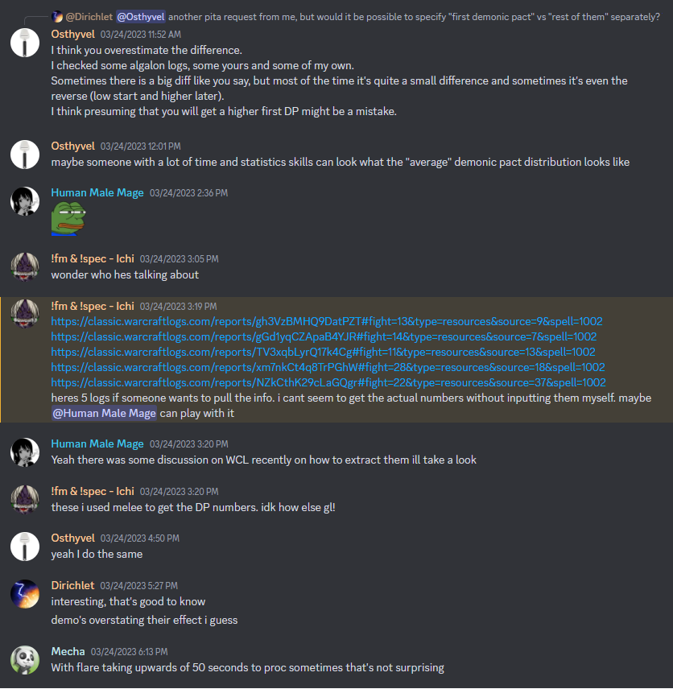
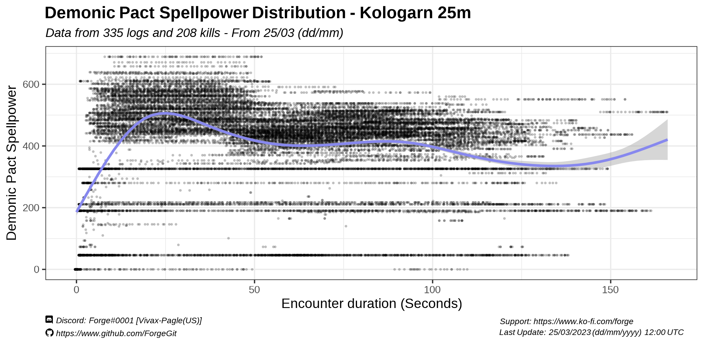

# Demonic Pact Spellpower Distribution

Using 335 logs randomly selected from all the logs uploaded to WCL early in the 25th of March, 2023, I extracted data for 54 Algalon and 208 Kologarn kills to look into demonic pact spellpower along the encounters.

The spellpower that I extracted for each log is from the first rogue listed in the Actors Table of that log. While the selection process could be refined to better standardize different trinket procs, raid performance and demo lock performance, this should be enough data to have a rough idea of the trend on it.

On average, the Kologarn kills lasted 112s [SD: 22] and the Algalon kills lasted 312s [SD:43]

# Table of Contents
1. [Data Selection](#hardmodes-wipes-and-kills-)  
2. [Overall distribution](#overall-tables---boss-encounters-) 
        2.1 [Kologarn 25m](#hardmode-classification-) 
        3.2 [Algalon 25m](#limitations-) 
        
       
## Overall distribution

### Kologarn 25m

  
 

