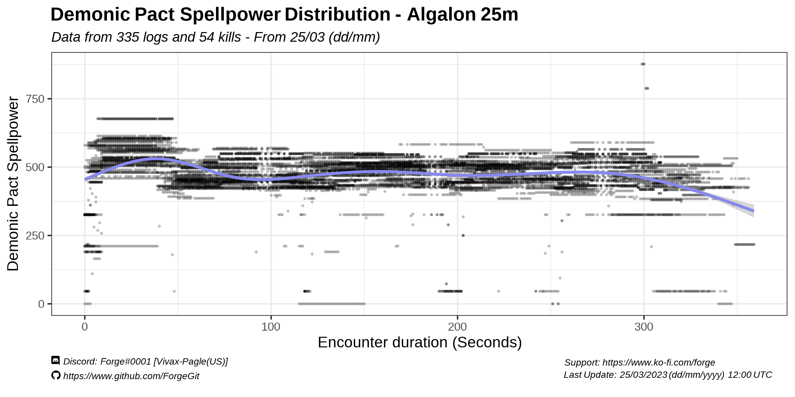
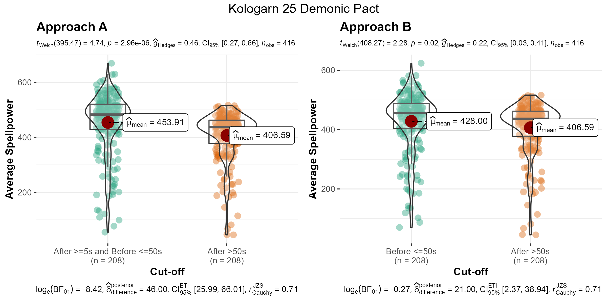
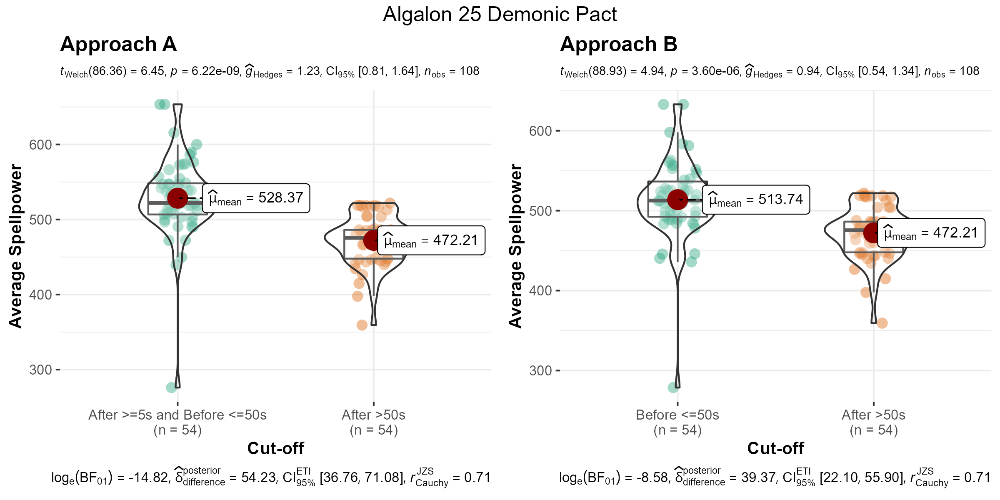
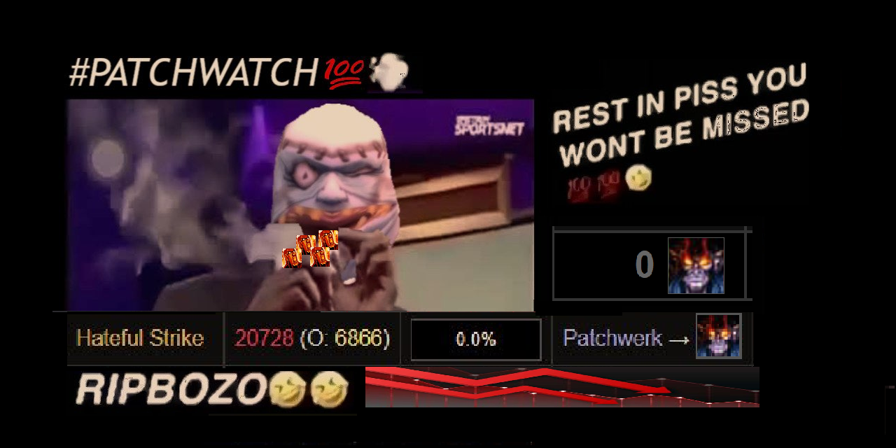

# Demonic Pact Spellpower Distribution

## ARE YOU SURE ABOUT THAT?

Using 335 logs randomly selected from all the logs uploaded to WCL early in the 25th of March, 2023, I extracted data for 54 Algalon and 208 Kologarn kills to __look into demonic pact spellpower distribution along the encounter duration__.

# Table of Contents
1. [Data Selection](#data-selection)  
2. [Overall distribution](#overall-distribution) 
        2.1 [Kologarn 25m](#kologarn-25m) 
        2.2 [Algalon 25m](#algalon-25m) 
3. [Comparison 50s into the pull vs rest of the fight](#comparison-50s-into-the-pull-vs-rest-of-the-fight) 
        3.1 [Kologarn 25m](#kologarn-25m-1) 
        3.2 [Algalon 25m](#algalon-25m-1) 
4. [Additional Comments](#additional-comments) 
5. [Tl;dr](#tldr) 

## Data Selection

The spellpower that I extracted for each log is from the first rogue listed in the Actors Table of that log. While the selection process could be refined to better standardize different trinket procs, raid performance and demo lock performance, this should be enough data to have a rough idea of the trend on it.

On average, the Kologarn kills lasted 112s [SD: 22] and the Algalon kills lasted 312s [SD:43]

## Overall distribution

There is definitively, on average, higher demonic pact spellpower on the first 50s or so of a fight

### Kologarn 25m

  
 
### Algalon 25m

  
 

## Comparison 50s into the pull vs rest of the fight 

To add a bit more of context on this data, you can summarise the spellpower gain from demonic pact in two groups:

**APPROACH A**
- After the 5s mark, before the 50s mark
- After the 50s mark

**APPROACH B**
- Before 50s mark
- After the 50s mark

The reason for using two approaches at estimating the average spellpower of demonic pact "on pull" is due to the first couple seconds of the fight being effectively "0 spellpower". So whether you consider or not those first 5 seconds of the pull as part of "the average spellpower your demo lock provides to you", is up for discussion and up to you really idk don't ask me. 

### Kologarn 25m

  
 
### Algalon 25m

  
 
## Additional comments 
*(From Louki#0810)*

Algalon and Kologarn have very different "proc profiles"

- Algalon: lose ~5s on prepot/tap, single target
- Kologarn: 0 time lost and precastable, aoe damage since demo locks typically seed there (-> inc chance to proc flare/dc/cloak) 

In theory, procs would happen twice early on, once until 5s, then again after flare/etc have procced. This seems to line up with the data too although its much more visible on the Algalon plot.
 
## Tl;DR

**Yes, demonic pact is higher on the first 50s of a fight. As we expected.** It is nice and good to see the data directly though.
        

## Other acknowledgments 

Thanks Stur [oreomcflurry - Pagle (US)] for the art

# Other projects (?)

- Other things I have done: https://github.com/ForgeGit?tab=repositories